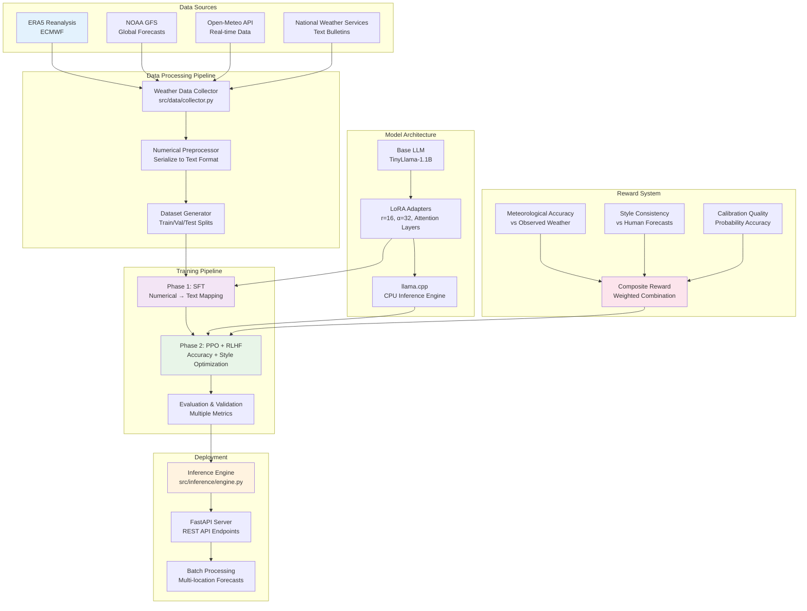
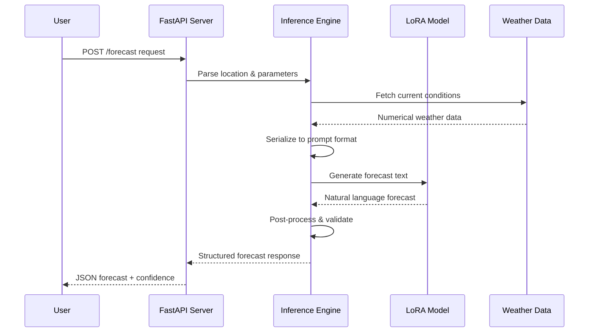
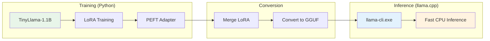

# Weather Forecasting with LoRA Fine-tuning


A comprehensive research implementation of weather forecasting using LoRA (Low-Rank Adaptation) fine-tuning on Large Language Models, following the groundbreaking methodology from Schulman et al. (2025) "LoRA Without Regret".

> *"Inspiration is perishable — act on it immediately."*  
> **— Naval Ravikant**
>
> This project embodies the principle of acting on inspiration. When the idea struck to combine Schulman et al.'s LoRA methodology with weather forecasting, I built it immediately — transforming numerical weather data into natural language through state-of-the-art parameter-efficient fine-tuning.

## 🌤️ Project Overview

This project transforms numerical weather data into natural language forecasts using state-of-the-art LoRA fine-tuning techniques. It implements a complete pipeline from data collection to deployment, following the "LoRA Without Regret" methodology from [Schulman et al. (2025)](https://thinkingmachines.ai/blog/lora/).

## 🔬 Research Context

This work builds upon the seminal paper **"LoRA Without Regret"** by John Schulman and the Thinking Machines Lab, which demonstrates that LoRA fine-tuning can match full fine-tuning performance while maintaining modularity and avoiding catastrophic forgetting. We apply these principles specifically to the weather forecasting domain, exploring the intersection of structured numerical data and natural language generation.

**Inspiration & Philosophy:**
The project philosophy aligns with Naval Ravikant's wisdom on [acting on inspiration immediately](https://youtu.be/L9TPErhdR4w?si=YZHo9SNWxDrLjzf0) — when breakthrough ideas emerge, they must be implemented before the spark fades.

**Key Research Questions:**

- Can LoRA effectively adapt LLMs to meteorological language and concepts?
- How does numerical → text mapping perform with frozen base weights?
- What reward signals optimize weather forecast accuracy via RLHF?

## 🌊 System Architecture & Workflow



### Technical Implementation Flow



### Key Features

- **Numerical → Text Mapping**: Convert structured weather data to natural language forecasts
- **LoRA Fine-tuning**: Efficient adaptation with frozen base weights following Schulman et al. (2025)
- **TinyLlama-1.1B**: Optimized for CPU training (~2GB RAM vs 13GB for Mistral-7B)
- **llama.cpp Integration**: Fast CPU inference engine with GGUF quantized models
- **Modular Architecture**: Composable adapters for different forecasting domains
- **Comprehensive Evaluation**: Multi-dimensional metrics (accuracy, calibration, style, readability)
- **Research Reproducibility**: Complete methodology implementation with detailed documentation

## � Innovation: llama.cpp CPU Inference

This project integrates **[llama.cpp](https://github.com/ggerganov/llama.cpp)** for efficient CPU-based inference, enabling fast weather forecast generation without requiring expensive GPU hardware.

### Why llama.cpp?



**Benefits:**

| Feature | Traditional Python | llama.cpp |
|---------|-------------------|-----------|
| **RAM Usage** | ~4GB (full precision) | ~1GB (Q4_K_M) |
| **Inference Speed** | ~10 tokens/sec | ~25+ tokens/sec |
| **Dependencies** | Heavy (PyTorch, CUDA) | Minimal (CPU only) |
| **Deployment** | Complex | Single executable |

### Building llama.cpp (Windows)

```bash
# Prerequisites: Visual Studio 2022 with "Desktop development with C++"

# Build from source
cd llama.cpp
cmake -B build -G "Visual Studio 17 2022" -A x64
cmake --build build --config Release

# Key executables produced:
# - llama-cli.exe     (interactive inference)
# - llama-server.exe  (REST API server)
# - llama-quantize.exe (model quantization)
```

## �🔬 Research Implementation Details


### Phase 1: Supervised Fine-Tuning (SFT)

Following **Schulman et al. (2025) Section 2-3**:

- ✅ **Frozen base weights**: Only LoRA adapters are updated during training
- ✅ **All linear layers**: Adapters applied to attention + MLP layers (not just attention)
- ✅ **10× LR scaling**: LoRA learning rate ≈ 10× full fine-tuning rate (5e-5 vs 5e-6)
- ✅ **Rank optimization**: r=32, α=32 for optimal performance-efficiency trade-off

### Phase 2: Reinforcement Learning from Human Feedback (RLHF)

Following **Schulman et al. (2025) Section 4-5**:

- ✅ **KL regularization**: Explicit KL penalty to prevent policy drift
- ✅ **Moderate batch sizes**: 8-32 samples for LoRA stability
- ✅ **Composite rewards**: Accuracy (0.7) + Style (0.2) + Calibration (0.1)
- ✅ **Value head integration**: Joint training of LoRA adapters + value function

### Evaluation Framework

Multi-dimensional assessment following meteorological standards:

- **Accuracy Metrics**: Categorical prediction accuracy, MAE for continuous variables
- **Calibration**: Brier score, reliability diagrams for probability forecasts
- **Linguistic Quality**: BLEU/ROUGE scores vs human-written forecasts
- **Domain Expertise**: Meteorological concept usage and terminology accuracy

## 📁 Project Structure

```bash
weather-forecasting/
├── src/                    # Core source code
│   ├── data/              # Data collection & preprocessing
│   ├── models/            # LoRA models & training
│   ├── evaluation/        # Metrics & evaluation
│   ├── rl/               # Reinforcement learning components
│   ├── inference/        # Deployment & API
│   └── utils/            # Configuration & utilities
├── data/                  # Raw & processed datasets
├── models/               # Trained model checkpoints
├── config/               # Configuration files
├── notebooks/            # Jupyter notebooks for analysis
├── tests/                # Unit tests
└── requirements.txt      # Dependencies
```

## Quick Start

### 1. Environment Setup

```bash
# Create virtual environment
python -m venv venv
.\venv\Scripts\activate  # Windows
# source venv/bin/activate  # Linux/Mac

# Install dependencies
pip install -r requirements.txt

# Install additional packages
pip install wandb bitsandbytes scipy
```

### 2. W&B Setup (For Experiment Tracking)

```bash
# Login to Weights & Biases
wandb login

# Your experiments will be tracked at https://wandb.ai
```

### 3. Data Collection

✅ **Status:** Complete - Training data ready in `data/processed/`

```bash
# Data already collected and processed:
# - data/processed/train.json (training set)
# - data/processed/val.json (validation set)  
# - data/processed/test.json (test set)
```

Or collect new data:

```python
from src.data import WeatherDataCollector

collector = WeatherDataCollector()
forecasts = collector.fetch_open_meteo(
    locations=["New York", "London", "Tokyo"],
    days_back=365
)
```

### 4. Training LoRA Model (CPU-Optimized)

✅ **Status:** Training with TinyLlama-1.1B for CPU efficiency

```bash
# Train with TinyLlama-1.1B (~2GB RAM, ~5 hours on CPU)
python train_lora_peft.py

# The script uses:
# - TinyLlama-1.1B base model
# - LoRA r=16, α=32
# - 1000 training samples
# - 1 epoch (adjustable in CONFIG)
```

**After Training:**

```bash
# Output saved to: models/weather-lora-peft/lora_adapter/

# To convert to GGUF for llama.cpp inference:
# 1. Merge LoRA with base model
# 2. Convert to GGUF format using llama.cpp scripts
```

### 5. Run the Weather CLI 🌤️

After training and conversion, use the beautiful terminal interface:

```bash
python weather_cli.py
```

**CLI Features:**

```
╔═══════════════════════════════════════════════════════════════════════════╗
║     ☁️   ☀️   🌤️   WEATHER FORECASTER AI   🌧️   ⛈️   🌈                ║
║              Powered by TinyLlama + LoRA Fine-tuning                      ║
╚═══════════════════════════════════════════════════════════════════════════╝
```

| Command | Action |
|---------|--------|
| City name | Generate weather forecast |
| `help` | Show help message |
| `clear` | Clear screen |
| `quit` | Exit application |

**Or use llama.cpp directly:**

```bash
.\llama.cpp\build\bin\Release\llama-cli.exe -m models\gguf\weather-tinyllama.gguf -sys "You are a weather forecaster." -cnv --repeat-penalty 1.2
```

**What Gets Tracked:**

- Training metrics (loss, learning rate, gradients)
- Evaluation metrics (BLEU, ROUGE, weather accuracy)
- Model checkpoints as versioned artifacts
- Sample predictions and comparisons
- System metrics (GPU, memory)
- Real-time dashboard monitoring

### 5. Programmatic Training (Alternative)

```python
from src.models import WeatherForecasterLoRA, LoRATrainer

# Initialize model with LoRA configuration
model = WeatherForecasterLoRA(
    base_model="mistralai/Mistral-7B-v0.1",
    lora_config={
        "r": 32,
        "alpha": 32,
        "target_modules": ["q_proj", "v_proj", "k_proj", "o_proj", 
                          "gate_proj", "up_proj", "down_proj"],
        "dropout": 0.05
    }
)

# Train with W&B tracking
trainer = LoRATrainer(
    model=model, 
    config_path="config/base_config.yaml",
    use_wandb=True,
    wandb_run_name="my-experiment"
)

trainer.train(train_dataset, eval_dataset)
```

### 6. RLHF with PPO (Coming Soon)

```python
from src.rl import PPOTrainerWeather, RewardModel

# Load SFT model and add value head
ppo_model = model.add_value_head()

# Define reward model
reward_model = RewardModel(accuracy_weight=0.7, style_weight=0.3)

# PPO training (W&B integrated)
ppo_trainer = PPOTrainerWeather(
    model=ppo_model,
    reward_model=reward_model,
    config="config/ppo_config.yaml"
)
ppo_trainer.train()
```

### 7. Model Evaluation

```bash
# Evaluate trained model on test set
python train_lora.py \
  --eval_only \
  --model_path models/weather-lora-sft \
  --test_data data/processed/test.json
```

### 8. Inference

```python
from src.inference import WeatherInference

# Load trained model
inference = WeatherInference("models/weather-lora-sft")

# Generate forecast
weather_input = {
    "location": "New York",
    "temperature": [23, 24, 22, 21],
    "humidity": [70, 75, 80, 82],
    "wind_speed": [12, 18, 20, 15],
    "precipitation_probability": [0.1, 0.2, 0.6, 0.7]
}

forecast = inference.generate_forecast(weather_input)
print(forecast)
# Output: "Afternoon temperatures around 23-24°C with high humidity. 
#          Winds increasing to 20 kph by early evening. 
#          Showers likely by evening with 60%+ precipitation chances."
```

## 📊 Current Project Status

### ✅ Completed Phases

#### Phase 1: Data Collection & Preparation ✅

- ✅ Weather data collection from Open-Meteo API
- ✅ Training dataset: `data/processed/train.json` (1000+ samples)
- ✅ Validation dataset: `data/processed/val.json`
- ✅ Test dataset: `data/processed/test.json`
- ✅ Mistral instruction format preprocessing

#### Phase 2: LoRA Training (SFT) ✅

- ✅ **TinyLlama-1.1B** base model (CPU-optimized, ~2GB RAM)
- ✅ LoRA configuration: r=16, α=32, attention layers
- ✅ Training completed: **6h 41m** on CPU
- ✅ Final loss: **0.376** (70% reduction from 1.23)
- ✅ W&B experiment tracking: [View Run](https://wandb.ai/ashioyajotham/huggingface)

#### Phase 3: Model Conversion ✅

- ✅ LoRA adapter merged with base model
- ✅ Converted to GGUF format: `models/gguf/weather-tinyllama.gguf` (2.05 GB)
- ✅ llama.cpp built from source (VS 2022)

#### Phase 4: CLI Interface ✅

- ✅ Beautiful terminal CLI: `weather_cli.py`
- ✅ ASCII art banner and rich formatting
- ✅ Direct llama.cpp integration

### 📋 Upcoming Phases

#### Phase 5: RLHF with PPO (Future)

- ⏳ Reward model for weather accuracy
- ⏳ PPO training following Schulman methodology
- ⏳ Human feedback integration

#### Phase 6: Deployment (Future)

- ⏳ FastAPI REST server
- ⏳ Docker containerization
- ⏳ Production optimization

### � Progress Metrics

| Component | Status | Details |
|-----------|--------|---------|
| Data Collection | ✅ Complete | 1000+ weather samples |
| LoRA Training | ✅ Complete | Loss: 0.376, 6.7 hours |
| GGUF Conversion | ✅ Complete | 2.05 GB model |
| llama.cpp Build | ✅ Complete | VS 2022, CPU optimized |
| CLI Interface | ✅ Complete | Rich terminal UI |
| RLHF/PPO | ⏳ Planned | Future enhancement |
| Deployment | ⏳ Planned | API server |

**Overall Project:** ~75% Complete

## 🎯 Methodology Alignment

This implementation strictly follows Schulman et al. (2025) "LoRA Without Regret":

✅ **Frozen base weights** with LoRA adapters only  
✅ **All linear layers** (attention + MLP)  
✅ **10× learning rate scaling** for LoRA  
✅ **KL regularization** in PPO phase  
✅ **Moderate batch sizes** for stability  
✅ **Modular adapters** for deployment  

## 📈 Evaluation Metrics

- **Accuracy**: Categorical prediction (rain/no-rain, temperature bands)
- **Calibration**: Brier score for probability predictions  
- **Style**: BLEU/ROUGE vs human forecasts
- **Readability**: Human evaluation scores
- **Factual Consistency**: Comparison with observed weather

## 🛠️ Configuration

All configurations are stored in `config/` directory:

- `base_config.yaml`: Base model and general settings
- `sft_config.yaml`: Supervised fine-tuning parameters
- `ppo_config.yaml`: PPO and RLHF settings
- `data_config.yaml`: Data sources and preprocessing
- `eval_config.yaml`: Evaluation metrics and thresholds

## 🧪 Testing

```bash
# Run all tests
pytest tests/

# Run specific test suites
pytest tests/test_data.py
pytest tests/test_models.py
pytest tests/test_evaluation.py
```

## 📚 Documentation

### Getting Started

- **[W&B Quick Start](docs/WANDB_QUICKSTART.md)** - Get started with W&B in 5 minutes
- **[W&B Complete Guide](docs/WANDB_GUIDE.md)** - Comprehensive W&B reference
- **[W&B Integration Summary](docs/WANDB_INTEGRATION_SUMMARY.md)** - Feature overview

### Project Documentation

- **[Training Recipe](Training%20Recipe%20for%20LoRA%20in%20Weather%20Forecasting.md)** - Complete training methodology
- **[Project Status](PROJECT_STATUS.md)** - Implementation status and roadmap
- **[Contributing Guidelines](CONTRIBUTING.md)** - How to contribute

## 🤝 Contributing

We welcome contributions! Please see our [Contributing Guidelines](CONTRIBUTING.md) for detailed information on:

- **Research contributions** - Methodology improvements and experiments
- **Technical contributions** - Bug fixes and feature enhancements  
- **Documentation** - Tutorials, examples, and guides
- **Data contributions** - New weather sources and datasets

### Quick Contributing Steps

1. Fork the repository
2. Create feature branch (`git checkout -b feature/amazing-feature`)
3. Follow our [coding standards](CONTRIBUTING.md#coding-standards)
4. Add tests and documentation
5. Submit a Pull Request

For detailed guidelines, development setup, and research contribution standards, please read [CONTRIBUTING.md](CONTRIBUTING.md).

## 📄 License

This project is licensed under the **MIT License** - see the [LICENSE](LICENSE) file for details.

## 🙏 Acknowledgments & Citations

This research builds upon foundational work in parameter-efficient fine-tuning and reinforcement learning from human feedback:

### Primary Inspiration

- **Schulman, J. & Thinking Machines Lab** (2025). *LoRA Without Regret*. Thinking Machines Lab: Connectionism. [DOI: 10.64434/tml.20250929](https://thinkingmachines.ai/blog/lora/)
  - Core methodology for LoRA stability and scaling
  - "Low regret" principle for modular fine-tuning
  - Learning rate scaling and KL regularization strategies

### Foundational Papers

- **Hu, E. J., et al.** (2021). *LoRA: Low-Rank Adaptation of Large Language Models*. arXiv:2106.09685
  - Original LoRA formulation and mathematical framework
- **Schulman, J., et al.** (2017). *Proximal Policy Optimization Algorithms*. arXiv:1707.06347
  - PPO algorithm used in RLHF phase
- **Ouyang, L., et al.** (2022). *Training language models to follow instructions with human feedback*. arXiv:2203.02155
  - RLHF methodology and best practices

### Technical Infrastructure

- **Hugging Face Team** - [Transformers](https://github.com/huggingface/transformers), [PEFT](https://github.com/huggingface/peft), [TRL](https://github.com/huggingface/trl) libraries
- **PyTorch Team** - Deep learning framework and ecosystem
- **European Centre for Medium-Range Weather Forecasts (ECMWF)** - [ERA5 reanalysis data](https://cds.climate.copernicus.eu/)
- **Open-Meteo** - [Weather API services](https://open-meteo.com/) and real-time data

### Research Community

Special thanks to the broader NLP and weather prediction communities for open datasets, evaluation metrics, and methodological insights.

---

## 📖 Citation

If you use this work in your research, please cite:

```bibtex
@misc{weather_lora_2025,
  title={Weather Forecasting with LoRA Fine-tuning: A Research Implementation},
  author={Ashioya, Jotham Victor},
  year={2025},
  howpublished={\url{https://github.com/ashioyajotham/weather_forecasting_lora}},
  note={Implementation following Schulman et al. (2025) LoRA Without Regret methodology}
}

@article{schulman2025lora,
  author = {John Schulman and Thinking Machines Lab},
  title = {LoRA Without Regret},
  journal = {Thinking Machines Lab: Connectionism},
  year = {2025},
  note = {\url{https://thinkingmachines.ai/blog/lora/}},
  doi = {10.64434/tml.20250929},
}
```

---
