# Weather Forecasting with LoRA Fine-tuning


[](https://thinkingmachines.ai/blog/lora/)


A comprehensive research implementation of weather forecasting using LoRA (Low-Rank Adaptation) fine-tuning on Large Language Models, following the groundbreaking methodology from Schulman et al. (2025) "LoRA Without Regret".

## 🌤️ Project Overview

This project transforms numerical weather data into natural language forecasts using state-of-the-art LoRA fine-tuning techniques. It implements a complete pipeline from data collection to deployment, following the "LoRA Without Regret" methodology from [Schulman et al. (2025)](https://thinkingmachines.ai/blog/lora/).

## 🔬 Research Context

This work builds upon the seminal paper **"LoRA Without Regret"** by John Schulman and the Thinking Machines Lab, which demonstrates that LoRA fine-tuning can match full fine-tuning performance while maintaining modularity and avoiding catastrophic forgetting. We apply these principles specifically to the weather forecasting domain, exploring the intersection of structured numerical data and natural language generation.

**Key Research Questions:**

- Can LoRA effectively adapt LLMs to meteorological language and concepts?
- How does numerical → text mapping perform with frozen base weights?
- What reward signals optimize weather forecast accuracy via RLHF?

## 🌊 System Architecture & Workflow

```mermaid
flowchart TD
    subgraph "Data Sources"
        A1[ERA5 Reanalysis<br/>ECMWF] 
        A2[NOAA GFS<br/>Global Forecasts]
        A3[Open-Meteo API<br/>Real-time Data]
        A4[National Weather Services<br/>Text Bulletins]
    end
    
    subgraph "Data Processing Pipeline"
        B1[Weather Data Collector<br/>src/data/collector.py]
        B2[Numerical Preprocessor<br/>Serialize to Text Format]
        B3[Dataset Generator<br/>Train/Val/Test Splits]
    end
    
    subgraph "Model Architecture"
        C1[Base LLM<br/>Mistral-7B / LLaMA-3-8B]
        C2[LoRA Adapters<br/>r=32, α=32, All Linear Layers]
        C3[Value Head<br/>For PPO Training]
    end
    
    subgraph "Training Pipeline"
        D1[Phase 1: SFT<br/>Numerical → Text Mapping]
        D2[Phase 2: PPO + RLHF<br/>Accuracy + Style Optimization]
        D3[Evaluation & Validation<br/>Multiple Metrics]
    end
    
    subgraph "Reward System"
        E1[Meteorological Accuracy<br/>vs Observed Weather]
        E2[Style Consistency<br/>vs Human Forecasts]
        E3[Calibration Quality<br/>Probability Accuracy]
        E4[Composite Reward<br/>Weighted Combination]
    end
    
    subgraph "Deployment"
        F1[Inference Engine<br/>src/inference/engine.py]
        F2[FastAPI Server<br/>REST API Endpoints]
        F3[Batch Processing<br/>Multi-location Forecasts]
    end
    
    A1 & A2 & A3 & A4 --> B1
    B1 --> B2 --> B3
    B3 --> D1
    
    C1 --> C2
    C2 --> D1
    D1 --> D2
    C2 --> C3
    C3 --> D2
    
    E1 & E2 & E3 --> E4
    E4 --> D2
    
    D2 --> D3
    D3 --> F1
    F1 --> F2 --> F3
    
    style A1 fill:#e3f2fd
    style D1 fill:#f3e5f5
    style D2 fill:#e8f5e8
    style F1 fill:#fff3e0
    style E4 fill:#fce4ec
```



### Technical Implementation Flow


### Key Features

- **Numerical → Text Mapping**: Convert structured weather data to natural language forecasts
- **LoRA Fine-tuning**: Efficient adaptation with frozen base weights following Schulman et al. (2025)
- **RLHF with PPO**: Optimize forecasts for accuracy and style using composite reward models
- **Modular Architecture**: Composable adapters for different forecasting domains
- **Comprehensive Evaluation**: Multi-dimensional metrics (accuracy, calibration, style, readability)
- **Research Reproducibility**: Complete methodology implementation with detailed documentation

## 🔬 Research Implementation Details

### Phase 1: Supervised Fine-Tuning (SFT)

Following **Schulman et al. (2025) Section 2-3**:

- ✅ **Frozen base weights**: Only LoRA adapters are updated during training
- ✅ **All linear layers**: Adapters applied to attention + MLP layers (not just attention)
- ✅ **10× LR scaling**: LoRA learning rate ≈ 10× full fine-tuning rate (5e-5 vs 5e-6)
- ✅ **Rank optimization**: r=32, α=32 for optimal performance-efficiency trade-off

### Phase 2: Reinforcement Learning from Human Feedback (RLHF)

Following **Schulman et al. (2025) Section 4-5**:

- ✅ **KL regularization**: Explicit KL penalty to prevent policy drift
- ✅ **Moderate batch sizes**: 8-32 samples for LoRA stability
- ✅ **Composite rewards**: Accuracy (0.7) + Style (0.2) + Calibration (0.1)
- ✅ **Value head integration**: Joint training of LoRA adapters + value function

### Evaluation Framework

Multi-dimensional assessment following meteorological standards:

- **Accuracy Metrics**: Categorical prediction accuracy, MAE for continuous variables
- **Calibration**: Brier score, reliability diagrams for probability forecasts
- **Linguistic Quality**: BLEU/ROUGE scores vs human-written forecasts
- **Domain Expertise**: Meteorological concept usage and terminology accuracy

## 📁 Project Structure

```bash
weather-forecasting/
├── src/                    # Core source code
│   ├── data/              # Data collection & preprocessing
│   ├── models/            # LoRA models & training
│   ├── evaluation/        # Metrics & evaluation
│   ├── rl/               # Reinforcement learning components
│   ├── inference/        # Deployment & API
│   └── utils/            # Configuration & utilities
├── data/                  # Raw & processed datasets
├── models/               # Trained model checkpoints
├── config/               # Configuration files
├── notebooks/            # Jupyter notebooks for analysis
├── tests/                # Unit tests
└── requirements.txt      # Dependencies
```

## Quick Start

### 1. Environment Setup

```bash
# Create virtual environment
python -m venv weather-lora-env
.\weather-lora-env\Scripts\activate  # Windows
# source weather-lora-env/bin/activate  # Linux/Mac

# Install dependencies
pip install -r requirements.txt
```

### 2. Data Collection

```python
from src.data import WeatherDataCollector

# Initialize data collector
collector = WeatherDataCollector()

# Fetch ERA5 reanalysis data
era5_data = collector.fetch_era5(
    start_date="2020-01-01",
    end_date="2023-12-31",
    variables=["temperature", "humidity", "pressure", "wind_speed"]
)

# Fetch Open-Meteo forecasts
forecasts = collector.fetch_open_meteo(
    locations=["New York", "London", "Tokyo"],
    days_back=365
)
```

### 3. Training LoRA Model

```python
from src.models import WeatherForecasterLoRA, LoRATrainer

# Initialize model with LoRA configuration
model = WeatherForecasterLoRA(
    base_model="microsoft/Mistral-7B-v0.1",
    lora_config={
        "r": 32,
        "alpha": 32,
        "target_modules": ["q_proj", "v_proj", "k_proj", "o_proj", "gate_proj", "up_proj", "down_proj"],
        "dropout": 0.05
    }
)

# Train with supervised fine-tuning
trainer = LoRATrainer(model=model, config="config/sft_config.yaml")
trainer.train(train_dataset, eval_dataset)
```

### 4. RLHF with PPO

```python
from src.rl import PPOTrainerWeather, RewardModel

# Load SFT model and add value head
ppo_model = model.add_value_head()

# Define reward model
reward_model = RewardModel(accuracy_weight=0.7, style_weight=0.3)

# PPO training
ppo_trainer = PPOTrainerWeather(
    model=ppo_model,
    reward_model=reward_model,
    config="config/ppo_config.yaml"
)
ppo_trainer.train()
```

### 5. Inference

```python
from src.inference import WeatherInference

# Load trained model
inference = WeatherInference("models/weather-lora-ppo")

# Generate forecast
weather_input = {
    "location": "New York",
    "temperature": [23, 24, 22, 21],
    "humidity": [70, 75, 80, 82],
    "wind_speed": [12, 18, 20, 15],
    "precipitation_probability": [0.1, 0.2, 0.6, 0.7]
}

forecast = inference.generate_forecast(weather_input)
print(forecast)
# Output: "Afternoon temperatures around 23-24°C with high humidity. 
#          Winds increasing to 20 kph by early evening. 
#          Showers likely by evening with 60%+ precipitation chances."
```

## 📊 Training Schedule

Following the 8-week schedule from the project specification:

- **Week 1**: Data Setup & Baseline
- **Week 2-3**: Phase 1 SFT with LoRA  
- **Week 4-5**: Phase 2 RL with PPO
- **Week 6**: Robustness & Ablations
- **Week 7**: Deployment Prep
- **Week 8+**: Continuous Feedback Loop

## 🎯 Methodology Alignment

This implementation strictly follows Schulman et al. (2025) "LoRA Without Regret":

✅ **Frozen base weights** with LoRA adapters only  
✅ **All linear layers** (attention + MLP)  
✅ **10× learning rate scaling** for LoRA  
✅ **KL regularization** in PPO phase  
✅ **Moderate batch sizes** for stability  
✅ **Modular adapters** for deployment  

## 📈 Evaluation Metrics

- **Accuracy**: Categorical prediction (rain/no-rain, temperature bands)
- **Calibration**: Brier score for probability predictions  
- **Style**: BLEU/ROUGE vs human forecasts
- **Readability**: Human evaluation scores
- **Factual Consistency**: Comparison with observed weather

## 🛠️ Configuration

All configurations are stored in `config/` directory:

- `base_config.yaml`: Base model and general settings
- `sft_config.yaml`: Supervised fine-tuning parameters
- `ppo_config.yaml`: PPO and RLHF settings
- `data_config.yaml`: Data sources and preprocessing
- `eval_config.yaml`: Evaluation metrics and thresholds

## 🧪 Testing

```bash
# Run all tests
pytest tests/

# Run specific test suites
pytest tests/test_data.py
pytest tests/test_models.py
pytest tests/test_evaluation.py
```

## 📚 Documentation

- [Getting Started Guide](GETTING_STARTED.md) - Complete setup and usage guide
- [Contributing Guidelines](CONTRIBUTING.md) - How to contribute to the project
- [Project Status](PROJECT_STATUS.md) - Implementation status and roadmap
- [API Reference](docs/api.md) - Detailed API documentation
- [Training Guide](docs/training.md) - Training methodology and best practices
- [Deployment Guide](docs/deployment.md) - Production deployment instructions
- [Contributing Guidelines](docs/contributing.md)

## 🤝 Contributing

We welcome contributions! Please see our [Contributing Guidelines](CONTRIBUTING.md) for detailed information on:

- **Research contributions** - Methodology improvements and experiments
- **Technical contributions** - Bug fixes and feature enhancements  
- **Documentation** - Tutorials, examples, and guides
- **Data contributions** - New weather sources and datasets

### Quick Contributing Steps

1. Fork the repository
2. Create feature branch (`git checkout -b feature/amazing-feature`)
3. Follow our [coding standards](CONTRIBUTING.md#coding-standards)
4. Add tests and documentation
5. Submit a Pull Request

For detailed guidelines, development setup, and research contribution standards, please read [CONTRIBUTING.md](CONTRIBUTING.md).

## 📄 License

This project is licensed under the MIT License - see the [LICENSE](LICENSE) file for details.

## 🙏 Acknowledgments & Citations

This research builds upon foundational work in parameter-efficient fine-tuning and reinforcement learning from human feedback:

### Primary Inspiration

- **Schulman, J. & Thinking Machines Lab** (2025). *LoRA Without Regret*. Thinking Machines Lab: Connectionism. [DOI: 10.64434/tml.20250929](https://thinkingmachines.ai/blog/lora/)
  - Core methodology for LoRA stability and scaling
  - "Low regret" principle for modular fine-tuning
  - Learning rate scaling and KL regularization strategies

### Foundational Papers

- **Hu, E. J., et al.** (2021). *LoRA: Low-Rank Adaptation of Large Language Models*. arXiv:2106.09685
  - Original LoRA formulation and mathematical framework
- **Schulman, J., et al.** (2017). *Proximal Policy Optimization Algorithms*. arXiv:1707.06347
  - PPO algorithm used in RLHF phase
- **Ouyang, L., et al.** (2022). *Training language models to follow instructions with human feedback*. arXiv:2203.02155
  - RLHF methodology and best practices

### Technical Infrastructure

- **Hugging Face Team** - [Transformers](https://github.com/huggingface/transformers), [PEFT](https://github.com/huggingface/peft), [TRL](https://github.com/huggingface/trl) libraries
- **PyTorch Team** - Deep learning framework and ecosystem
- **European Centre for Medium-Range Weather Forecasts (ECMWF)** - [ERA5 reanalysis data](https://cds.climate.copernicus.eu/)
- **Open-Meteo** - [Weather API services](https://open-meteo.com/) and real-time data

### Research Community

Special thanks to the broader NLP and weather prediction communities for open datasets, evaluation metrics, and methodological insights.

---

## 📖 Citation

If you use this work in your research, please cite:

```bibtex
@misc{weather_lora_2025,
  title={Weather Forecasting with LoRA Fine-tuning: A Research Implementation},
  author={Ashioya Jotham Victor},
  year={2025},
  howpublished={\url{https://github.com/ashioyajotham/weather_forecasting_lora}},
  note={Implementation following Schulman et al. (2025) LoRA Without Regret methodology}
}

@article{schulman2025lora,
  author = {John Schulman and Thinking Machines Lab},
  title = {LoRA Without Regret},
  journal = {Thinking Machines Lab: Connectionism},
  year = {2025},
  note = {\url{https://thinkingmachines.ai/blog/lora/}},
  doi = {10.64434/tml.20250929},
}
